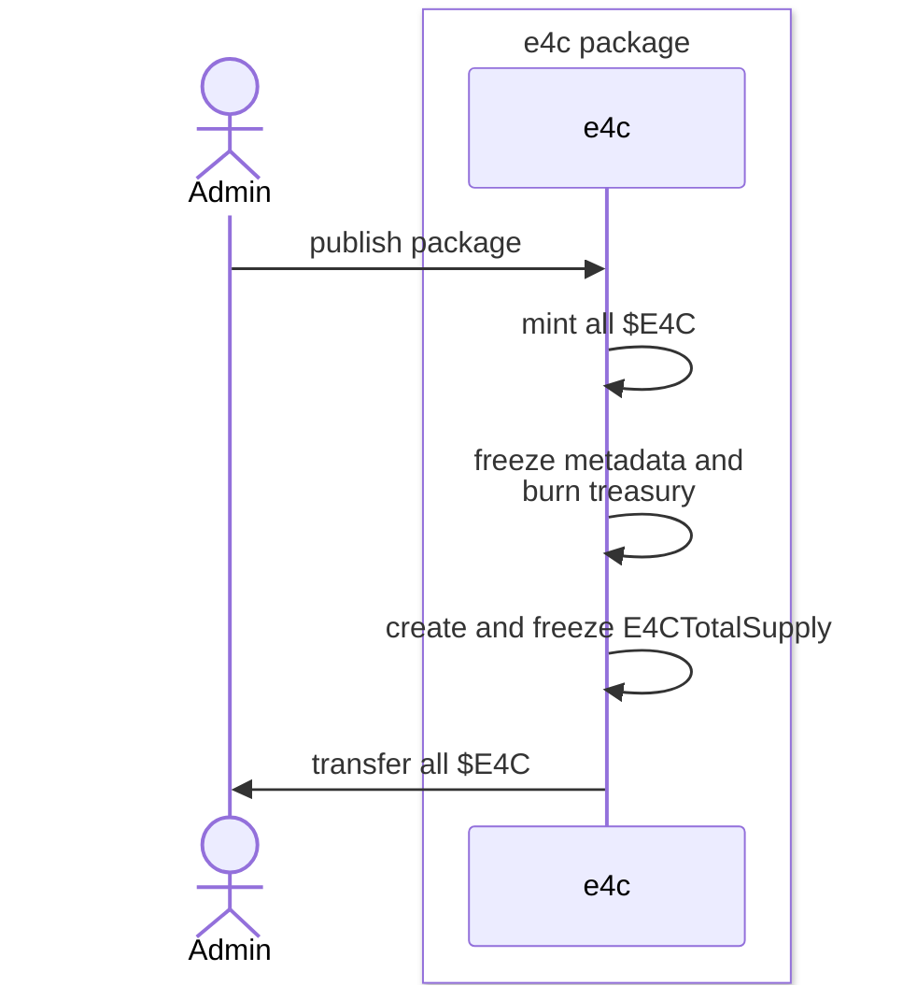
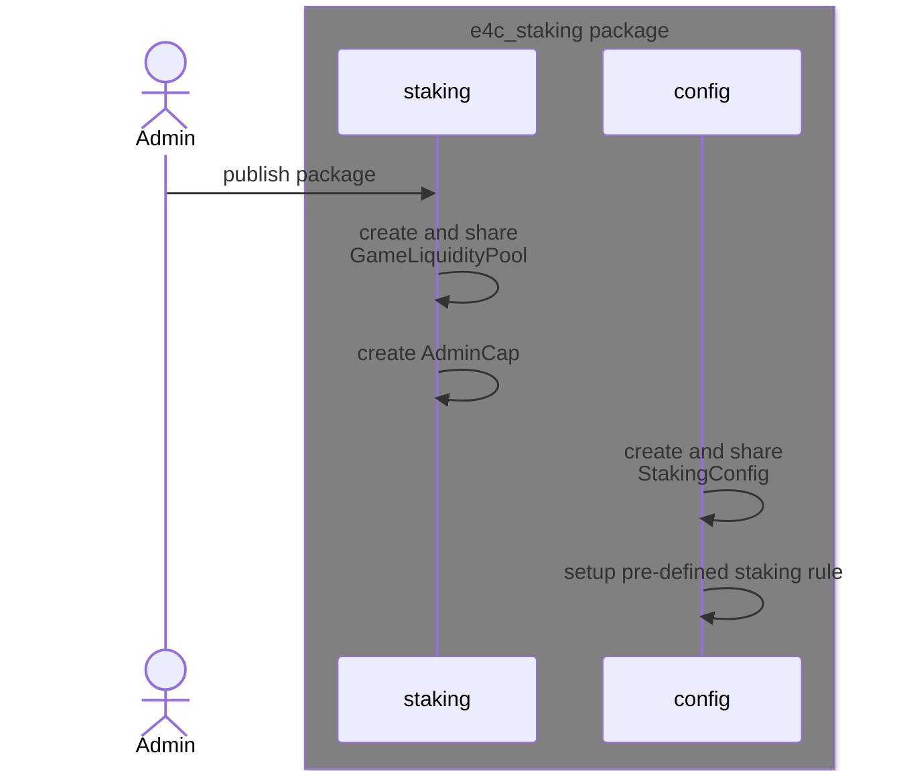
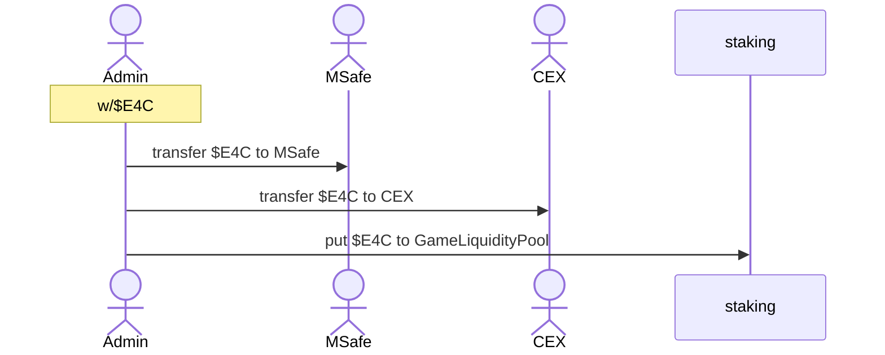
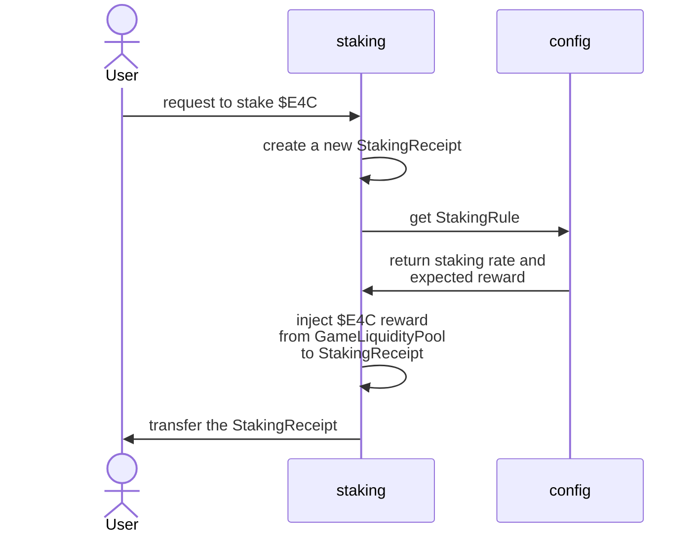
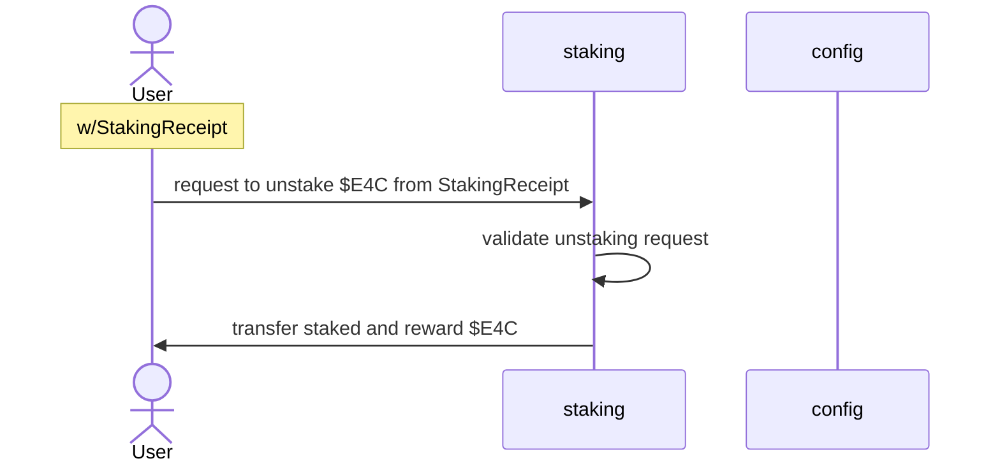
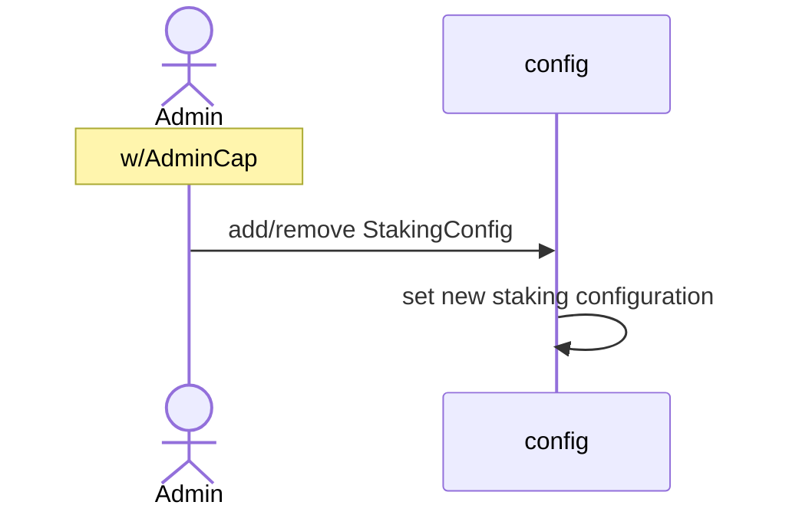

# ambrus-e4c

## Overview

This repository contains the smart contracts for the Ambrus $E4C token.

Modules high level description:

- E4C Package: Handles the creation and minting of E4C tokens.
    - E4C Module: Handles the creation and minting of E4C tokens.
- E4C Staking Package: Handles the staking of E4C tokens.
    - Staking Module: Handles staking of E4C tokens for veE4C, including reward injection.
    - Config Module: Handles the configuration of the staking pool.

## Sequence Diagram

### Publish e4c Package and mint $E4C

The following sequence diagram illustrates the process of publishing a package and minting the E4C token.

### Publish e4c_staking package

The following sequence diagram illustrates the process of publishing a package for the staking module.

Make sure to publish the e4c package first and add the e4c_package dependency
to [./e4c_staking/Move.toml](e4c_staking/Move.toml).

### Distribute $E4C

The following sequence diagram illustrates the process of distributing the E4C token to shareholders.

### Stake $E4C

The following sequence diagram illustrates the process of staking $E4C token.

### Unstake and Claim Reward

The following sequence diagram illustrates the process of unstaking $E4C token.

### Configure Staking Rules

The following sequence diagram illustrates the process of configuring the staking pool.

