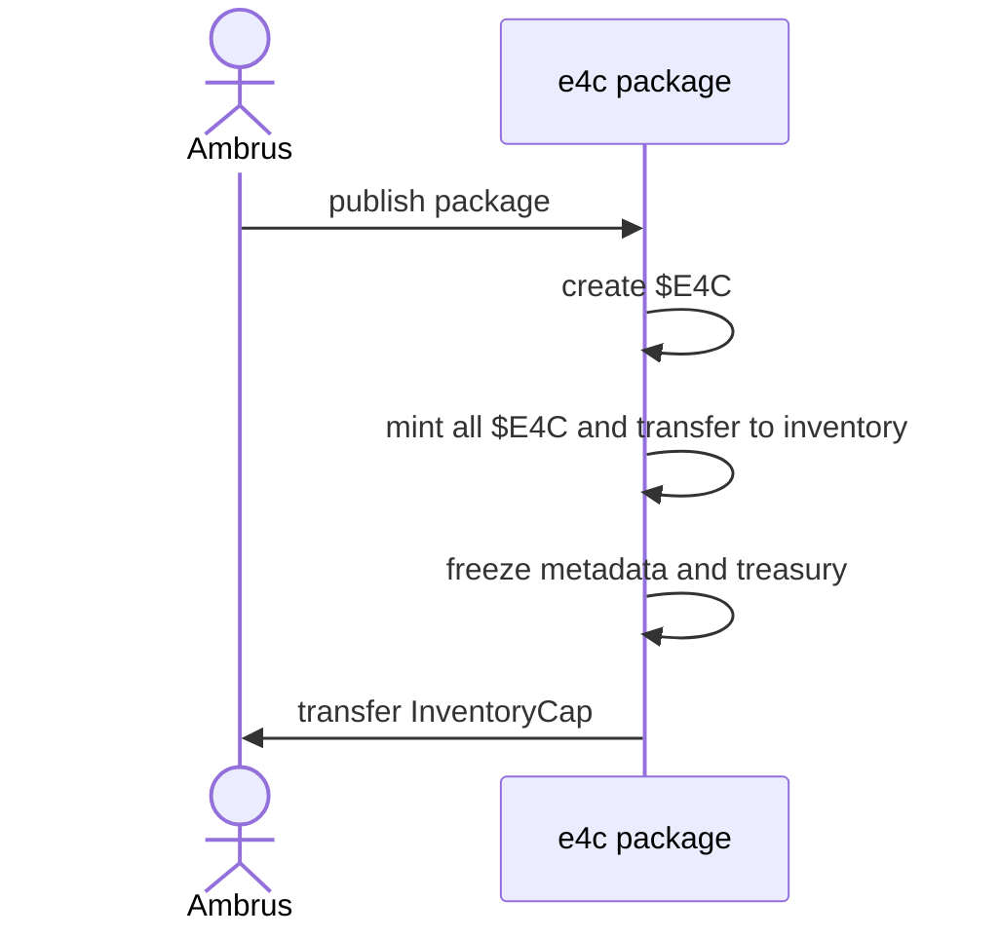
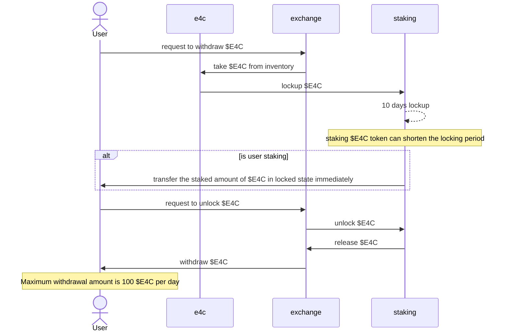
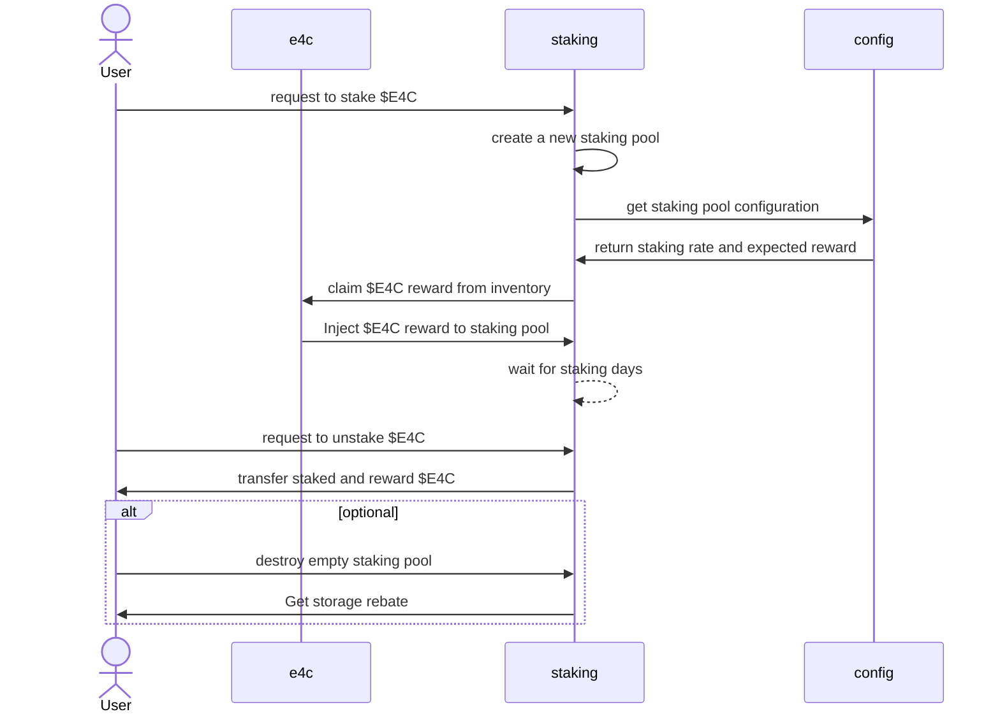

# ambrus-e4c

## Overview

This repository contains the smart contracts for the Ambrus $E4C token.

## Sequence Diagram

### Publish Package and Mint $E4C

The following sequence diagram illustrates the process of publishing a package and minting the E4C token.

### Withdraw $E4C

The following sequence diagram illustrates the process of withdrawing $E4C token.

### Stake and Unstake $E4C

The following sequence diagram illustrates the process of staking and unstaking $E4C token.

### Configure Staking Pool

The following sequence diagram illustrates the process of configuring the staking pool.

