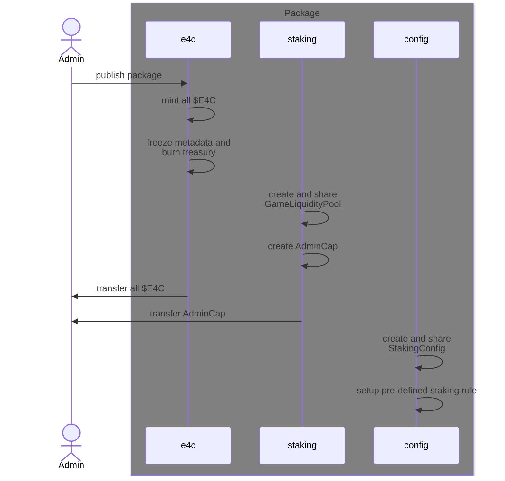
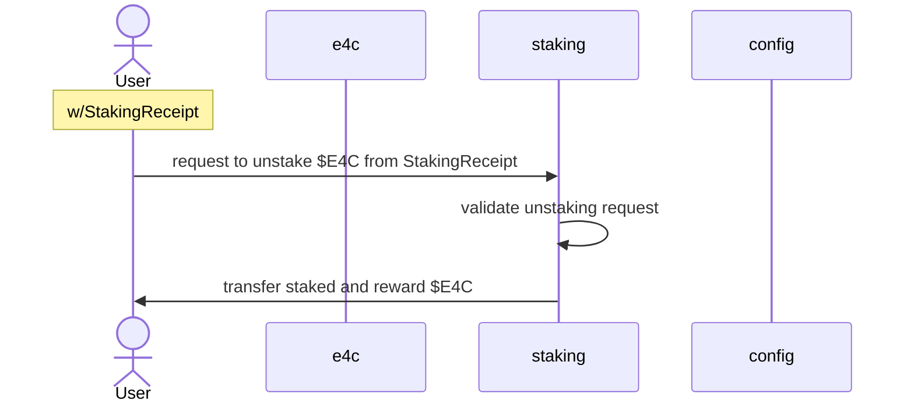
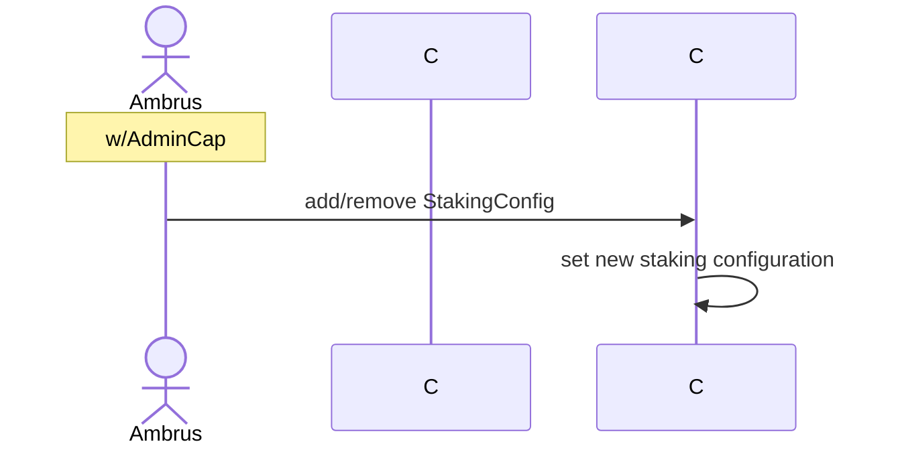

# ambrus-e4c

## Overview

This repository contains the smart contracts for the Ambrus $E4C token.

Modules high level description:

- E4C Module: Handles the creation and minting of E4C tokens.
- Staking Module: Handles staking of E4C tokens for veE4C, including reward calculations.
- Config Module: Handles the configuration of the staking pool

## Sequence Diagram

### Publish Package and Mint $E4C

The following sequence diagram illustrates the process of publishing a package and minting the E4C token.

### Distribute $E4C

The following sequence diagram illustrates the process of distributing the E4C token to shareholders.

### Stake and Unstake $E4C

The following sequence diagram illustrates the process of staking $E4C token.

### Unstake and Claim Reward

The following sequence diagram illustrates the process of unstaking $E4C token.

### Configure Staking Rules

The following sequence diagram illustrates the process of configuring the staking pool.

